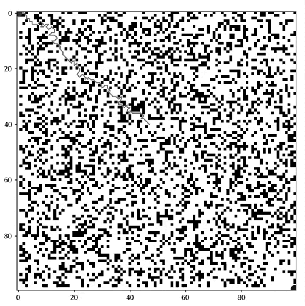

# Path Planning in Unknown Environments using Ant Colony Optimization

This project implements a path planning algorithm for unknown environments using Ant Colony Optimization (ACO). It proposes a heuristic based on suboptimal paths within a limited vision radius of virtual ants.

## Idea

In path planning, the robot in unknown environments sometimes cannot determine the globally optimal path due to limited environmental information. This scenario necessitates a heuristic approach to effectively navigate and plan paths in such uncertain conditions.

This algorithm introduces an heuristic for this scnenarios. It operates by selecting the shortest path within an ant's visual range, combining local optimization with global navigation towards a final objective.

The process works as follows:

    1- In each iteration, the algorithm considers a limited map area representing the ant's current field of vision.

    2- A local objective point is dynamically determined based on the direction to the final goal. This allows for adaptive navigation as new areas are discovered.
    
    3- Within this limited vision area, the algorithm identifies the shortest path to the local objective.
    
    4- The best local path is stored, and the ant is moved to a new position along this path.
    
    5- This logic is then repeated with the newly revealed map area. The process continues until the final objective is reached.

## Result

## Run Code 

*obs*: Ensure you have Python installed.

1- Using GUI interface

"""
python3 ./solver.py

"""

2- Passing params

"""
python3 ./solver.py -a 10 -i 100 -m map1.txt -p 0.1 -pa 1 -r 5 -d
"""